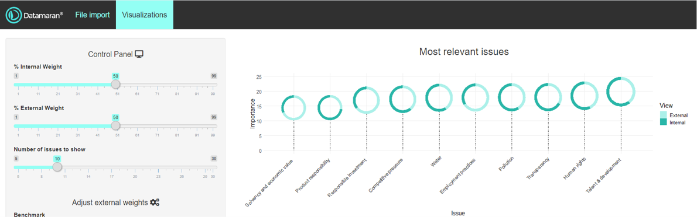
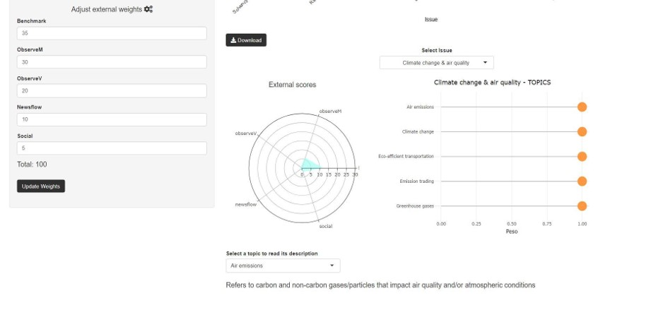
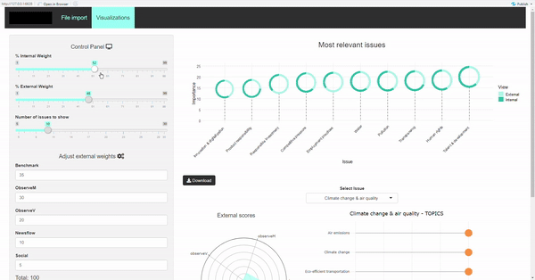

# Issue Dashboard

## Description

Shiny-based dashboard developed in R to study the importance of some issues.

## How it works

The first graph (lollipops), shows the issues with more relevance ordered from left to right and, at the same time, show which part of their total score comes from the "internal" or "external" part.

The first two sliders on the left adjust the weight (%) given to "external" and "internal" scores. Moving one of them makes the other adjust automatically.

The third slider defines how many issues are to be shown in the graph.

   

The second part allows the user to study a specific issue in depth. The radar or spider graph shows the scores of the different areas that form the "external" score. 

The horizontal lollipo graph shows the weights of the topics that are included in the selected issue.

The panel on the lefs allows the user to adjust the weights of the different areas that form the "external" score of all issues. The sum of all of them must be 100 in order to push the "update" button. If this condition is not met an error message appears. Another error message appears if not all the fields are filled in.

The last drop-down list below shows a description of the selected topic.

   

## Demonstration

   

Disclaimer: The data used for this app is not available due to privacy issues.
